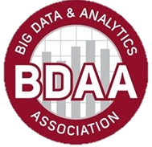

AMEND Consulting Case Competition
=================================

Hosted by the [Big Data and Analytics Association][BDAA]

Problem Statement
-----------------

AMEND Consulting has hired BDAA as subcontractors to help analyze data for a manufacturing
client, Metal Working Group (MWG).
MWG runs a job shop specializing in various metal fabrication applications.
They have given us over 5 years of financial transaction data representing every single job
completed.
It is our job to find the important insights in the data and then **recommend the best actions
to maximize profit for the business**.

Guiding Questions
-----------------

This analysis is intended to open-ended and creative, however, here are some key areas to look
at:

- Trend Analysis – Looking for Increase / Decrease / Variability in:
  - Profit / Revenue / Cost
  - of Customers
  - of Jobs Shipped
  - of Parts per Shipment
- 80 / 20 Pareto Analysis:
  - Which customers create the most revenue / cost?
  - Which parts drive the most revenue  / cost?
- Forecasts
- **MAKE RECOMMENDATIONS FOR DECISIONS**
  - Finance / Sales
  - Operations

Final Deliverable
-----------------

The final deliverable is a PowerPoint Presentation detailing the key insights found and
recommendations for action.
Presentation time is limited to **10 minutes** with an additional 5 minutes for questions.
Please feel free to include additional analysis in the Appendix.

*Hint*:
Focus on the business impact and the decisions to be made, **NOT** the complex analysis.

Competition Logistics
---------------------

- **Wednesday, January 27th**:
  Data will be made available to any participant who signs the Non-Disclosure Agreement
    - Participants will form groups of 2-4 members each. Teams can register by using the link
    in the footer.

- **Tuesday, February 2nd from 5-6 pm**:
  AMEND will host a conference call on for anyone who has questions.
    - Dial-in Number: 605-562-0020
    - Access Code: 107-832-002

- **Sunday, February 7th at 4:30-6 pm**:
  BDAA will host an optional session where participating teams can present to E-Board members
  to get feedback on their presentations.

- **Friday, February 12th between 3-5 pm**:
  Finally, participants will present to a group of AMEND and MWG executives.
  - **Presentations must be sent to ohiostatebdaa@gmail.com by *12:00pm on February 12th*.**

- Prizes: $300 for 1st Place, $200 for 2nd Place, $100 for 3rd Place

[Link To Registration][Registration]

[Registration]: https://docs.google.com/forms/d/1_e-vDDIpOaxFppKGoqTZ0YDT64xqcCGm60fwv7lgg7w/viewform
[BDAA]: http://bdaaatohiostate.org/
